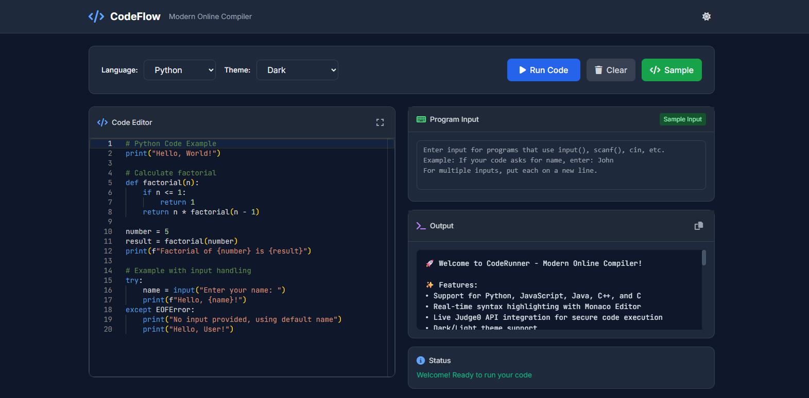

# CodeFlow - Modern Online Compiler

<p align="center">
  
  <b>A modern, elegant online compiler supporting C, C++, Java, Python, and JavaScript. Powered by the Judge0 API, CodeFlow lets you write, run, and test code instantly in your browser with a beautiful, theme-adaptive interface.</b><br><a href="https://codeflow.vercel.app" target="_blank">Visit Now</a> <br>

</p>

## 🚀 Features

- Monaco Editor with syntax highlighting
- Language selection: C, C++, Java, Python, JavaScript
- Input/output and execution status panels
- Light/Dark/High Contrast themes
- Responsive, professional UI (Tailwind CSS + custom CSS)
- Judge0 API integration for real code execution


## 🎯 Project Goal

Provide developers with a hassle-free online coding environment—no local IDE or setup required. Instantly test code, learn new languages, or prototype ideas directly in your browser.


## 🛠️ Usage

1. Select your language and theme.
2. Write or paste your code in the editor.
3. (Optional) Enter program input above the output panel.
4. Click **Run Code** to execute and see output instantly.

## 🛠️ Local Setup
1. Clone or download this repository.
2. Open `index.html` in your browser.
3. (Optional) Add your Judge0 API key in `script.js` for full functionality.

## 📁 File Structure
- `index.html` — Main UI and layout
- `style.css` — All theming, layout, and responsive rules
- `script.js` — Editor setup, API integration, and logic

## Credits
- [Monaco Editor](https://microsoft.github.io/monaco-editor/)
- [Judge0 API](https://judge0.com/)
- [Tailwind CSS](https://tailwindcss.com/)

---
**CodeFlow** — Built for developers who love clean code.

Then open `http://localhost:8000` in your browser.

## 📁 File Structure

```
Online Compiler/
├── index.html      # Main HTML file with responsive layout
├── style.css       # Modern CSS with dark/light theme support
├── script.js       # JavaScript with Judge0 API integration
└── README.md       # This file
```

## 🎨 Customization

### Adding New Languages

1. **Update Language IDs** in `script.js`:
```javascript
this.languageIds = {
    'python': 71,
    'javascript': 63,
    'java': 62,
    'cpp': 54,
    'c': 50,
    'your_language': ID_HERE  // Add new language
};
```

2. **Add Language Template**:
```javascript
this.templates = {
    // ... existing templates
    'your_language': `// Your language template code here`
};
```

3. **Update HTML Select Options**:
```html
<select id="language">
    <!-- existing options -->
    <option value="your_language">Your Language</option>
</select>
```

### Theming

The application supports extensive theming through CSS variables in `style.css`. You can customize:
- Colors and gradients
- Typography and fonts
- Spacing and layout
- Animations and transitions

## 🔧 Browser Support

- **Chrome/Chromium**: Full support
- **Firefox**: Full support
- **Safari**: Full support
- **Edge**: Full support
- **Mobile browsers**: Responsive design optimized for touch

## 🌟 Pro Tips

1. **Keyboard Shortcuts**:
   - `Ctrl + Enter`: Run code
   - `Ctrl + L`: Clear output
   - `Ctrl + /`: Comment/uncomment lines (in editor)

2. **Editor Features**:
   - Mouse wheel zoom
   - Bracket pair colorization
   - Code folding
   - Auto-indentation

3. **Mobile Usage**:
   - Landscape orientation recommended
   - Touch-friendly interface
   - Responsive layout adapts to screen size

## 🚀 Performance Optimizations

- Lazy loading of Monaco Editor
- Efficient API polling
- Optimized CSS with minimal reflows
- Cached theme preferences
- Debounced user interactions

## 🔒 Security

- All code execution happens in Judge0's sandboxed environment
- No code is stored on the client
- API keys should be secured on production deployments
- Input sanitization and validation

## 📱 Mobile Experience

The application is fully responsive and optimized for mobile devices:
- Touch-friendly buttons and controls
- Optimized editor experience for mobile
- Responsive grid layout
- Mobile-specific CSS optimizations

## 🤝 Contributing

Feel free to contribute to this project by:
1. Adding support for more programming languages
2. Improving the UI/UX design
3. Adding new features (syntax highlighting themes, etc.)
4. Optimizing performance
5. Fixing bugs and issues

## 📄 License

This project is open source and available under the [MIT License](LICENSE).

## 🙏 Acknowledgments

- **Monaco Editor**: Microsoft's excellent code editor
- **Judge0**: Robust code execution API
- **Tailwind CSS**: Utility-first CSS framework
- **Font Awesome**: Beautiful icons
- **Inter & JetBrains Mono**: Great typography

## 📞 Support

If you encounter any issues or have questions:
1. Check the browser console for errors
2. Verify your Judge0 API key is correct
3. Ensure you have a stable internet connection
4. Try refreshing the page

---

**Happy Coding! 🎯**
